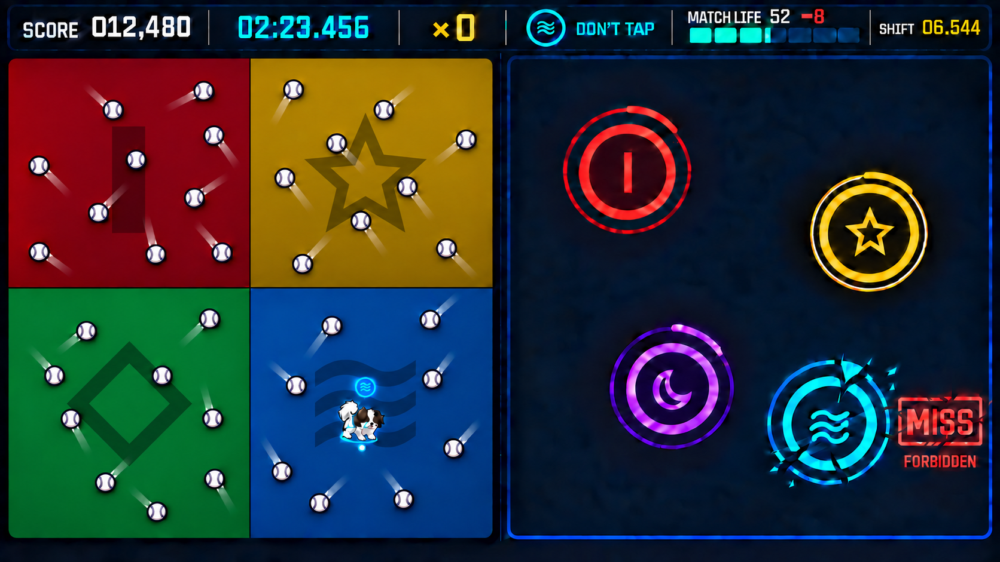
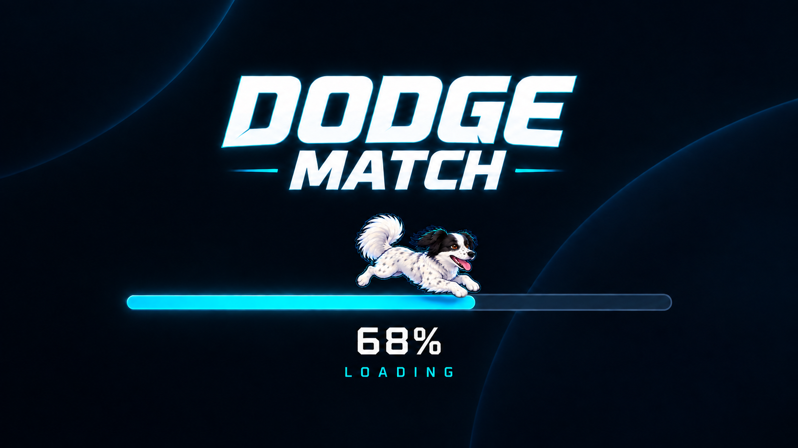
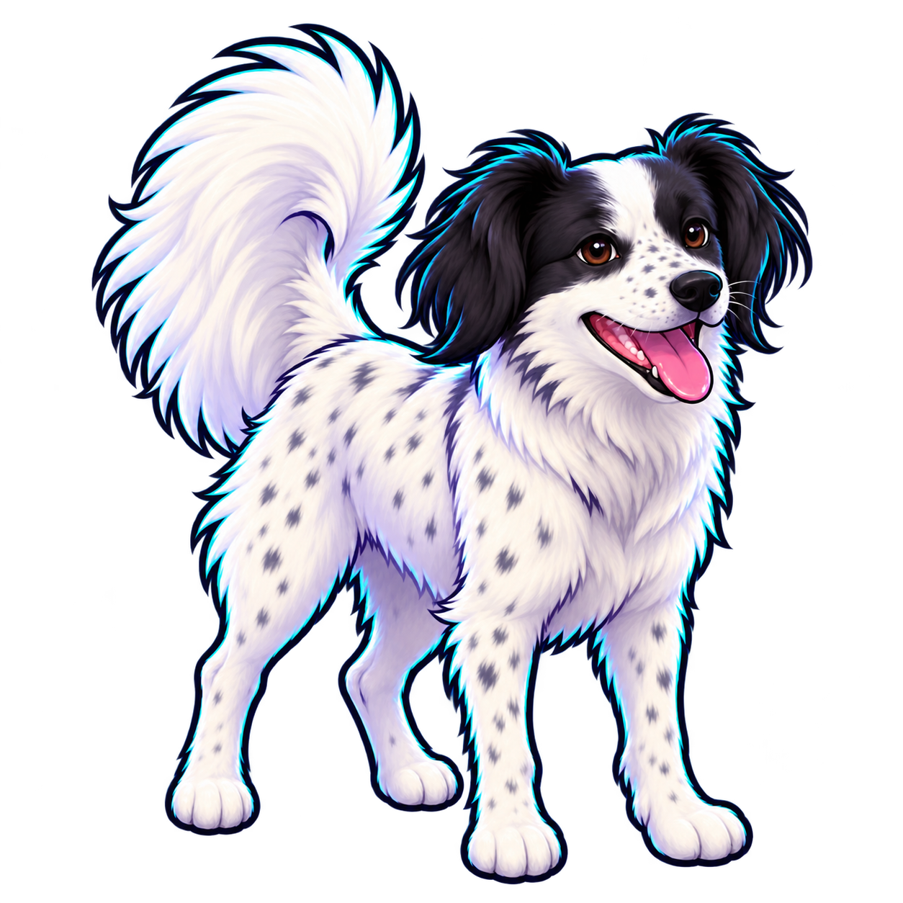
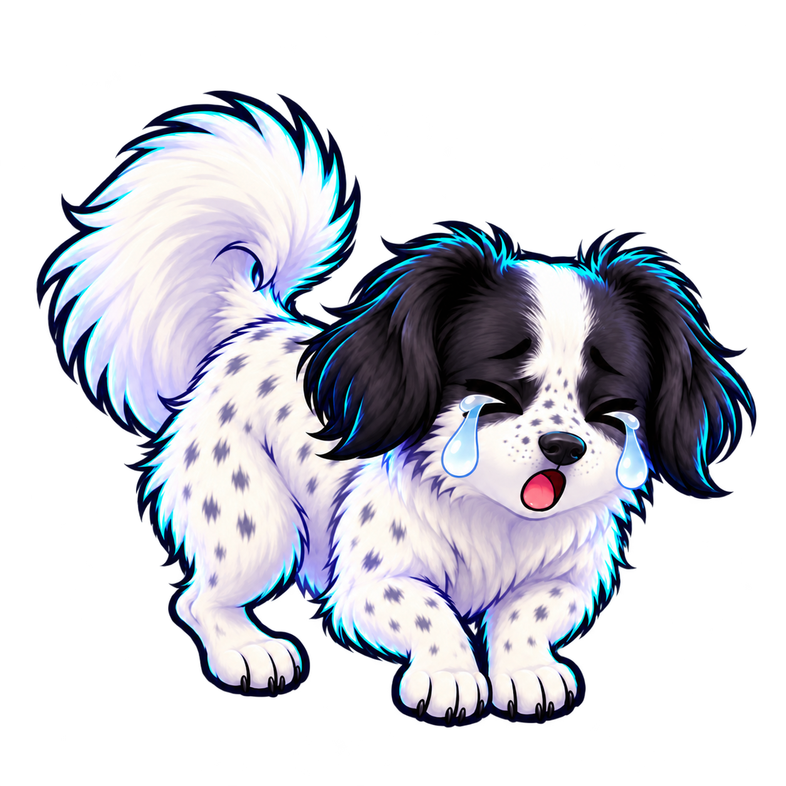

# Dodge Match 인터페이스·비주얼 디자인 플랜

- 작성일: 2026-09-16
- 상태: 첫 구현 비주얼 기준선 — 최종 자산은 별도 디자인 작업
- 기준 문서: [동시 플레이 게임 기획](gameplay.md), [점수와 플레이어 경쟁](scoring-and-leaderboard.md)
- 기준 화면: 모바일·PC 공통 가로 16:9, 좌우 50:50 배치

## 가로 플레이 콘셉트 시안 v15



이 시안은 확정된 가로 16:9, 좌우 50:50 구조를 반영한다. `02:23.456` 시점의 중후반 플레이를 가정해 Dodge의 4색 구역과 약 26개의 중성색 야구공, 표시 반지름 2U로 줄인 반려견 캐릭터, Match 안전 영역 안에 무작위로 흩어진 동시 원 4개를 표현했다. Dodge 바닥에는 각 구역색에 대응하는 Match 문양 하나를 크게 새긴다. 빨강은 `│`, 노랑은 `✦`, 초록은 `◆`, 파랑은 `≈`이며, 낮은 대비의 톤온톤 바닥 각인으로 처리한다. `+`·`×`, 궤도선, 대각선·부채꼴·비네트 음영과 작은 반복 무늬는 사용하지 않는다. 플레이필드의 `DODGE / MATCH` 제목도 표시하지 않는다. 검은 십자 경계는 총 0.125U의 1px급 헤어라인이며, 강아지 아래 청백색 점이 실제 구역 판정에 쓰는 공통 바닥 피벗을 보여준다. 야구공은 생성 위치와 최초 진행각만 판의 시드로 추첨하고 활성화 뒤에는 정반사로만 움직인다. Match 원 위치는 시드 기반 무작위 배치 예시이며, 야구공 개수는 게임플레이 문서의 `3/6/10/15/22/28/32개` 곡선을 따른다.

문양이 없는 야구공 시안 [v14](../design/concepts/neon-orbit-baseball-hazards-v14.png), 점 위험물을 사용한 [v13](../design/concepts/neon-orbit-orbital-floor-v13.png), 완전 단색 바닥의 [v12](../design/concepts/neon-orbit-hairline-boundary-v12.png), 0.5U 경계의 [v11](../design/concepts/neon-orbit-minimal-zone-margin-v11.png), 1U 경계와 이전 Dodge 문양이 남은 [v10](../design/concepts/neon-orbit-thin-zone-margin-v10.png), 넓은 2U 경계의 [v9](../design/concepts/neon-orbit-small-dog-fixed-hitbox-v9.png), 이전 크기의 [v8](../design/concepts/neon-orbit-raised-difficulty-v8.png)과 정상 상태 [v6](../design/concepts/neon-orbit-gameplay-neutral-dense-dots-v6.png)는 변화 기록으로 보존한다.

## 초기 로딩 화면 동작



- 앱 셸과 게임 제목은 즉시 그린다. 필수 자산 로딩이 150ms 안에 끝나면 달리기 연출을 생략하고 시작 설정 화면으로 넘어간다.
- 150ms를 넘기면 긴 진행 바, 정수 `n%`와 강아지를 표시한다. 진행 바의 채워진 끝점과 강아지 위치가 항상 일치한다.
- 강아지는 오른쪽을 향해 달리는 6프레임 루프를 재생한다. 외형은 `player-dog-idle-v2.png`의 검은 늘어진 귀, 얼굴 무늬, 점박이 흰 털, 말린 꼬리와 발톱 없는 둥근 발을 그대로 유지한다.
- 구현 자산은 [player-dog-loading-run-v1.png](../design/characters/player-dog-loading-run-v1.png)다. 사용자가 고른 상태 시트의 상단 가운데 뻗은 달리기와 하단 가운데 즐거운 공중 자세를 핵심 프레임으로 삼고, 압축 준비→뻗기→모으기→짧은 도약→내려오기→착지의 6단계를 12fps, 500ms 주기로 잇는다.
- `n%`는 필수 자산의 실제 가중 완료량이며 뒤로 가지 않는다. 100%는 디코딩과 차트 검증까지 완료된 상태다.
- `Reduced Effects`에서는 같은 진행 위치에 정지 포즈를 표시한다. 실패 시에는 진행률을 100%로 만들지 않고 `LOAD FAILED / RETRY`로 전환한다.

## 1. 디자인 목표

한 화면에서 회피와 타이밍 게임을 동시에 읽을 수 있어야 한다. Dodge는 공간과 움직임, Match는 색과 박자를 담당한다. 두 영역은 형태 언어를 분리하되, 캐릭터가 서 있는 구역의 색이 Match 금지색이라는 연결은 항상 보여준다.

첫 구현 시각 방향은 **Neon Orbit Arcade**로 확정한다. 어두운 남청색 바탕, 밝은 7색 신호, 굵은 외곽선과 픽셀 감성의 표시 서체를 조합한다. 캐릭터와 효과는 둥근 벡터 형태로 만들어 작은 모바일 화면에서도 읽히게 한다. 레트로 분위기는 해상도를 낮추는 방식보다 타이포그래피, 제한된 발광, 짧고 명확한 모션에서 만든다.

핵심 원칙은 다음과 같다.

1. **동시 시인성:** 시선을 한쪽에 두어도 다른 쪽의 위험·판정·생명 변화를 주변 시야로 감지할 수 있어야 한다.
2. **색 이외의 단서:** 7색의 고유 기호를 Match 원, 캐릭터 위 현재색 배지, HUD 칩과 Dodge 바닥 각인에 일관되게 사용한다. 바닥 각인은 야구공보다 낮은 대비로 두고 현재 금지색 표시는 배지와 HUD가 담당한다.
3. **판정 순간의 명료함:** 링과 원 테두리가 접촉하는 순간이 효과가 없어도 보인다. 장식 모션이 정답 시점을 가리지 않는다.
4. **게임 정보 우선:** 점수, 시간, 콤보, 생명과 금지색은 플레이 오브젝트와 겹치지 않는 고정 HUD에 둔다.
5. **실패 원인 설명:** 게임 오버 연출과 결과 화면에서 회피 충돌인지 Match 생명 소진인지 바로 알 수 있다.

## 2. 가로 화면 구조

논리 기준은 1600×900이며 중앙선을 기준으로 두 플레이 영역을 50:50으로 나눈다. 기본은 Dodge 왼쪽, Match 오른쪽이고 설정에서 완전히 대칭 교환한다.

```text
┌────────────────────────────────────────────────────────────────────┐
│ SCORE 012,480   02:23.456   ×18   LIFE ███████░   SHIFT 03.742    │ HUD 9%
├─────────────────────────────────┬──────────────────────────────────┤
│                                 │                                  │
│    점 •     Pip       •         │       ◯          ◯               │
│                                 │            ◯                     │
│  현재 금지색 칩                 │                     ◯            │
│                                 │                                  │
└─────────────────────────────────┴──────────────────────────────────┘
```

- 공통 HUD는 합산 점수, 분:초.밀리초 시간, 점수 콤보, Match 생명과 다음 색 전환 시간을 표시한다.
- 현재 금지색 칩은 Dodge 쪽 캐릭터 가까이와 공통 HUD 양쪽에서 확인할 수 있게 한다.
- Dodge와 Match 영역에는 플레이 오브젝트와 순간 판정 텍스트만 둔다.
- 플레이 중 영역 안에는 `DODGE`, `MATCH` 같은 고정 제목을 표시하지 않는다. 위치와 오브젝트 형태만으로 영역을 구분한다.
- Match 원 생성 안전 여백은 영역 가장자리 24 논리 픽셀로 시작하고 최소 48dp 터치 영역을 유지한다.
- 좁은 가로 화면에서도 플레이 영역 비율을 바꾸지 않는다. 전체 캔버스를 축소하고 남는 화면은 레터박스로 처리한다.
- 세로 방향에서는 게임 대신 회전 안내를 보여준다.

## 3. 시각 토큰과 색상

### 기본 화면색

| 토큰 | 값 | 용도 |
| --- | --- | --- |
| `ink-950` | `#080B18` | 앱 최외곽 배경 |
| `ink-900` | `#10152B` | 플레이필드 기본면 |
| `ink-800` | `#1B2240` | HUD·패널 |
| `line` | `#354064` | 비활성 테두리·구분선 |
| `text-primary` | `#F7F8FF` | 주요 숫자·텍스트 |
| `text-secondary` | `#AAB3D2` | 보조 설명 |
| `shadow` | `#02030A` | 외곽선·그림자 |

### 일곱 색과 보조 기호

| 색 이름 | 신호색 | 구역 바탕 | Match·상태 기호 |
| --- | --- | --- | --- |
| 빨강 | `#FF5C6C` | `#351824` | 세로 막대 `│` |
| 주황 | `#FF9F43` | `#392315` | 삼각 `▲` |
| 노랑 | `#FFD93D` | `#3A3212` | 별 `✦` |
| 초록 | `#45D483` | `#143425` | 마름모 `◆` |
| 파랑 | `#35B9FF` | `#123047` | 물결 `≈` |
| 남색 | `#7182FF` | `#1A2148` | 이중점 `:` |
| 보라 | `#C86BFA` | `#321A44` | 초승달 `◐` |

- 구역 바탕은 저채도·저명도 색을 쓰고, 원·링과 금지색 칩에는 밝은 신호색을 쓴다.
- Dodge 구역은 거의 평면인 단색 위에 구역색과 대응하는 Match 문양 하나만 크게 새긴다. 작은 반복 패턴이나 별도 모서리 아이콘은 두지 않는다.
- 고유 기호는 Match 원 중심, 캐릭터 바로 위 현재색 배지와 공통 HUD 금지색 칩에만 표시한다.
- 빨강을 실패 전용색으로 쓰지 않는다. `Miss`는 빨강과 별도로 형태·텍스트·흔들림으로 표현한다. 빨간 원도 정상 타깃일 수 있기 때문이다.
- 텍스트와 중요한 외곽선은 배경색에 따라 흰색 또는 `ink-950`을 선택한다. 실제 대비는 구현 시 WCAG 대비 검사로 확인한다.

### Dodge 바닥 환경 레이어

- 각 사분면 중앙에는 해당 구역색의 Match 문양을 하나만 둔다. 빨강 `│`, 주황 `▲`, 노랑 `✦`, 초록 `◆`, 파랑 `≈`, 남색 `:`, 보라 `◐`의 동일한 매핑을 사용하며 현재 화면에는 빨강·노랑·초록·파랑 문양이 보인다.
- 바닥은 균일한 단색 또는 아주 약한 수직 명도 변화만 허용한다. 궤도선, 비네트, 대각선, 부채꼴, 광선, 얼룩과 겹치는 그림자 등 별도 환경 음영은 사용하지 않는다.
- 문양은 지역 바닥색보다 5~7% 어둡거나 밝은 톤온톤 각인으로 만들고 발광·유채색 강조·외곽선은 넣지 않는다. `×`와 `+` 문양은 사용하지 않는다.
- 작은 점, 입자, 격자와 짧은 선은 야구공이나 이동 꼬리와 혼동되므로 쓰지 않는다.
- 플레이 중에는 정지 상태로 유지한다. 메뉴 전환에서만 최대 1px 수준의 느린 시차를 허용하며 `Reduced Effects`에서는 완전히 고정한다.

## 4. 반려견 기반 캐릭터 디자인

사용자가 제공한 반려견 사진과 영상 프레임을 바탕으로 첫 캐릭터 기준안을 제작했다. 검은 늘어진 귀, 비대칭 검은 눈가 무늬와 흰 이마선, 흰 주둥이·몸·다리의 작은 점무늬, 높이 말린 풍성한 흰 꼬리, 혀를 내민 밝은 표정을 핵심 식별점으로 유지한다.



- 기본 게임 스프라이트: [player-dog-idle-v2.png](../design/characters/player-dog-idle-v2.png)
- 이전 동작 참고 시트: [player-dog-state-sheet-v1.png](../design/characters/player-dog-state-sheet-v1.png)
- 이전 금지색 오입력 반응: [player-dog-forbidden-cry-v1.png](../design/characters/player-dog-forbidden-cry-v1.png)
- v2 방향은 실제 특징을 유지하면서 머리와 꼬리를 조금 키운 둥근 아케이드 마스코트다. 짙은 외곽선, 옅은 보라 그림자, 가는 청록 림라이트를 사용한다.
- **발톱은 표시하지 않는다.** 발은 흰 털로 덮인 부드러운 둥근 형태로 그리고, 발가락을 나눌 필요가 있을 때만 아주 옅은 아이보리 또는 연보라 음영을 쓴다. 검정·짙은 회색의 발톱이나 발가락 선은 금지한다.
- v1 상태 시트와 울음 자산은 자세·표정 참고용이다. 두 파일의 어두운 발톱 표현은 폐기했으며 dev 런타임 자산으로 사용하지 않는다.

- 원본 사진·영상은 공개 저장소에 커밋하지 않는다. 캐릭터 제작 입력으로만 사용하고, 사용자가 승인한 파생 게임 자산만 `docs/design` 또는 dev 자산 경로에 넣는다.
- 영상은 얼굴·전신·대표 움직임이 선명한 프레임을 추출해 사진과 함께 참고한다. 추출 프레임도 공개 저장소에는 넣지 않는다.
- v2는 첫 구현 기준 자산으로 채택하고, 실제 플레이 축소 QA에서 식별성이 부족할 때 외곽선·점무늬 밀도·머리 비율만 조정한다.
- 필요한 상태는 `idle`, `move`, `near-hit`, `hit`, `match-success`다. 각 상태는 좌우 어느 배치에서도 사용할 수 있게 방향 의존 장식을 피한다.
- 마스터 자산은 충분히 큰 투명 PNG로 보관하고 실제 게임에서는 약 18~22dp로 표시한다. 축소했을 때 귀·얼굴 윤곽과 핵심 무늬가 남아야 한다.
- 충돌 판정은 그림의 털이나 귀 끝과 분리한다. 표시 반지름 2U 안에 캐릭터를 배치하고 실제 원형 충돌 반지름은 1.5U로 고정한다. 최초 3U 안보다 그림을 약 33% 줄여 고밀도 점 사이의 경로를 더 잘 보이게 한다.
- 모든 상태 자산은 같은 바닥 중심 피벗과 투명 캔버스를 사용한다. 몸을 낮추거나 기울이고, 꼬리·귀·눈물·잔상과 표시 스케일이 변해도 충돌 원은 월드 좌표의 공통 피벗과 1.5U 반지름을 그대로 사용한다.
- 몸체에는 3dp 상당의 어두운 외곽선을 두어 일곱 바닥색에서 윤곽을 유지한다.
- 현재 구역색은 캐릭터 아래의 반투명 원형 조명과 캐릭터 바로 위의 고유 기호 배지로 표시한다. 조명 중심에는 실제 구역 판정점인 공통 바닥 피벗을 나타내는 2px 청백색 점을 둔다. 이 효과는 캐릭터 고유 털색을 덮지 않는다.
- 이동 중에는 몸체가 진행 방향으로 최대 8° 기울고 80ms 길이의 짧은 잔상이 생긴다. 정지 중에는 1.2초 주기의 2% 호흡 모션만 사용한다.
- 위험 근접 시 외곽선이 한 번 수축하고, 충돌 시 표정과 실루엣이 함께 바뀐다. 강한 섬광으로 캐릭터 특징을 가리지 않는다.

### 금지색 오입력 `ㅠoㅠ` 반응



이 이미지는 울음 자세·표정 참고용 v1이다. 실제 구현용 재생성에서는 v2의 발 규칙을 적용해 어두운 발톱을 제거한다.

#### Match와 Dodge의 동시 피드백

[중성 야구공·Match 색별 문양 바닥·0.125U 경계와 작은 강아지, Match Miss 동시 표현 전체 화면 v15](../design/concepts/neon-orbit-match-glyph-floor-v15.png)

- 같은 `Miss(FORBIDDEN)` 이벤트에서 Match와 Dodge가 서로 다른 정보를 담당한다.
- Match에서는 잘못 누른 원 바로 옆에 `MISS`를 표시하고 아래에 원인 `FORBIDDEN`을 붙인다. 원 테두리는 140ms 동안 갈라지고 사라진다.
- Dodge에서는 강아지만 `ㅠoㅠ` 울음 포즈로 480ms 바뀐다. 강아지 옆에는 `MISS` 문자를 중복 표시하지 않는다.
- Match 쪽에는 눈물이나 강아지 감정 아이콘을 표시하지 않는다. 플레이어가 시선을 어느 영역에 두고 있어도 같은 실수를 인지하되 의미는 중복하지 않는다.
- 첫 Miss 예시에서는 점수 콤보가 `×0`으로 초기화되고 Match 생명은 `60→52`, `−8`로 표시된다. 실제 감소량은 현재 Miss 연속 횟수 규칙을 따른다.
- v15는 `02:23.456`의 약 26개 중후반 야구공 밀도, 2U 강아지 표시 크기, 0.125U 헤어라인 경계와 Match 색별 문양 바닥을 함께 확인하는 시안이다. 야구공과 궤적은 아이보리·남청·흰색·회색만 사용한다.

- 금지 상태로 잠긴 원을 터치해 `Miss(FORBIDDEN)`이 발생할 때만 사용한다. 일반적인 빠름·늦음·놓침 Miss에는 사용하지 않는다.
- 검은 귀가 조금 처지고 몸을 낮춘 채 앞발을 모으며, 눈은 `ㅠ ㅠ`처럼 아래로 감기고 입은 작은 `o` 모양이 된다. 문자 `ㅠoㅠ`를 직접 표시하지 않는다.
- 양쪽 눈물은 축소 화면에서도 읽히도록 크게 표현하되 옅은 청백색으로 제한한다. 현재 금지색이나 7색 신호와 연결되는 색 효과는 추가하지 않는다.
- 전체 반응은 480ms다: 0~80ms 몸을 8% 낮추기, 80~360ms 울음 포즈 유지, 360~480ms 현재 이동 상태로 복귀한다.
- 반응 중에도 Dodge 이동, 야구공 충돌, Match 차트와 게임 시계는 계속된다. 표시 자산만 바뀌며 2U 표시 범위와 1.5U 충돌 반지름은 변하지 않는다.
- 같은 판정으로 Match 생명이 0이 되면 울음 포즈를 최소 120ms 보여준 뒤 `SYNC LOST` 게임 오버 연출로 연결한다.

## 5. 회피 야구공 디자인

회피 오브젝트는 Match 타이밍 원과 혼동되지 않도록 **작은 중성색 야구공**으로 만든다. 둥근 실루엣은 기존 원형 물리 판정을 그대로 보여주고, 두 개의 곡선 봉제선이 Match 원과 다른 정체성을 만든다.

야구공은 네 색 구역을 합친 Dodge 전체 사각형을 한 공간으로 사용한다. 내부 십자 경계를 그대로 통과하며 최외곽 벽에서만 반사한다. 인게임 시안에서는 일부 야구공의 이동 꼬리가 색 경계를 가로지르게 배치해 구역별로 갇혀 움직인다는 오해를 막고, 내부 경계에는 반사광이나 충돌 효과를 표시하지 않는다.

- 몸체: 지름 10~14dp의 아이보리 원, 2dp의 짙은 남청색 외곽선. 두 개의 곡선 봉제선과 짧은 스티치는 회색·남청색으로 그리며 빨간 실이나 다른 유채색은 쓰지 않는다.
- 이동: 속도 방향 뒤에 24~40ms 길이의 짧은 흰색·회색 꼬리를 둬 궤적을 읽게 한다. 실제 충돌 범위는 본체만이다.
- 회전: 진행 거리 기준으로 일정하게 회전해 비행감을 더한다. 회전 각도, 봉제선 방향과 렌더 프레임은 이동 벡터·원형 충돌·벽 반사 계산에 어떤 영향도 주지 않으며 `Reduced Effects`에서는 방향을 고정한다.
- 벽 반사: 입사각과 반사각이 같은 정반사를 적용한다. 접점에 100ms짜리 흰색·회색 각도 표시를 내고 꼬리 방향을 물리 속도 벡터에 맞춰 즉시 전환한다. 시각 효과가 실제 궤적을 바꾸지 않으며 과도한 파티클은 쓰지 않는다.
- 추가 생성: 등장 위치에 500ms 전 흰색·회색 십자 조준선과 수축 점을 보여준다. 캐릭터 안전 거리 안에는 예고도 생성하지 않는다.
- 야구공의 몸체, 봉제선, 꼬리, 반사, 생성 예고와 충돌 효과에는 7색 신호색이나 별도 유채색을 사용하지 않는다. 색은 구역과 Match 판정 정보에만 사용한다.
- 속도·개수가 늘어도 모든 위험물은 같은 야구공 모양을 쓴다. 위험도 색상 등급을 추가하면 구역색 규칙과 충돌하므로 피한다.

## 6. 타이밍 원과 수축 링

타이밍 오브젝트는 **중심 원 + 색 테두리 + 고유 기호 + 바깥 수축 링**의 네 층으로 만든다.

| 요소 | 권장값 | 역할 |
| --- | --- | --- |
| 중심 원 | 지름 56dp, `ink-900` 채움 | 터치 대상의 본체 |
| 색 테두리 | 5dp, 해당 신호색 | 원의 색 식별 |
| 중심 기호 | 22dp, 해당 신호색 또는 흰색 | 색 이외의 식별 |
| 수축 링 | 3dp, 시작 지름 96dp → 56dp | 정답 시각 표시 |
| 터치 여유 | 본체 바깥 최대 8dp | 모바일 조작성 보정 |

- 링은 처음부터 끝까지 끊김 없는 실선으로 줄어든다. 꼬리, 회전, 점멸은 정확한 접촉 시점을 흐리므로 쓰지 않는다.
- 정답 순간 링과 원 테두리가 정확히 겹치며 60ms 동안 2dp 흰색 접촉광이 나타난다. 접촉광은 판정을 알려주는 장식이고 판정 계산 기준은 아니다.
- T−200ms에 상태가 잠기면 허용 타깃은 중심 기호가 한 번 선명해지고, 금지 타깃은 중심에 `손대지 않음`을 뜻하는 두 줄 보호띠가 생긴다. 보호띠에는 해당 색 기호를 유지해 색을 가리지 않는다.
- 금지 타깃은 링이 똑같이 수축한다. 플레이어가 ‘누르지 않을 타이밍’도 읽을 수 있어야 하기 때문이다.
- 여러 원이 겹쳐 보일 때 앞뒤 관계가 생기지 않도록 링과 터치 여유 영역까지 겹치지 않는 배치를 우선한다. 불가피한 경우 생성 순서가 빠른 원의 링을 더 밝게 하고 중심 위에 작은 순번 점을 둔다.
- Match 영역에는 고정 격자, 사분면 또는 타깃 슬롯을 표시하지 않는다. 각 원 중심은 매 판의 난수 시드로 안전 영역 전체에서 독립 추첨하며, 본체와 터치 여유 영역이 기존 원과 겹치면 재추첨한다. 따라서 여러 원은 행·열·대칭으로 정렬되지 않고 자연스럽게 흩어져 보여야 한다.
- 판정 후 원은 140ms 이내에 사라진다. 성공은 중심으로 수축, Miss는 두 조각으로 갈라져 바깥으로 6dp 이동한다.

## 7. HUD, 점수판과 시간 표시

### 플레이 중 점수판

- 점수: `SCORE 012,480`처럼 최대 자릿수를 고려해 왼쪽 정렬한다. 숫자가 늘어도 주변 요소가 움직이지 않도록 고정 폭 영역을 둔다.
- 시간: `02:23.456`처럼 분:초와 소수점 이하 세 자리를 표시한다. 점수와 폭이 흔들리지 않도록 고정 폭 영역을 사용한다.
- 숫자 서체: tabular numerals를 지원하는 고정폭 또는 반고정폭 서체. 소수점과 세 자리 밀리초의 폭이 흔들리지 않아야 한다.
- 화면 갱신: 내부 시간은 단조 증가 시계를 사용한다. 표시는 매 프레임 갱신하되, 프레임이 끊겨도 시간이 느려지거나 되감기지 않는다.
- 콤보: `×18`을 오른쪽에 표시하고 10, 25, 50, 100 구간 진입 시 한 번 확대한다. 계속 튀는 애니메이션은 피한다.

### 연결 HUD

- 금지색 칩: `DON'T TAP` 라벨, 신호색 선, 고유 기호, 색 이름을 함께 표시한다. 바닥 판정점이 헤어라인 반대편 가장자리를 벗어난 스텝에 캐릭터 조명·위 배지와 상태값을 함께 바꾸고 100ms 동안 표시만 교차 전환한다.
- Match 생명: 길이 140dp 이상 수평 게이지. 현재 수치 `60`을 내부에 표시한다. 회복은 오른쪽으로 흐르는 광선과 `+4`, 중립은 짧은 흰색 테두리, 감소는 왼쪽으로 밀리는 절단선과 `−8`로 표현한다.
- 색 전환 시간: `SHIFT 03.742`처럼 소수점 세 자리까지 표시한다. 마지막 0.500초에는 배경이 한 번 좁아지고 `LOCK` 보조 문구를 표시해 새 원 생성 중지 구간을 알린다.
- 생명 25 이하는 게이지 윤곽이 두꺼워지고 심박 모션을 한 번씩 낸다. 색만 붉게 바꾸지 않는다.

### 결과 점수판

결과 화면의 우선순위는 최종 점수 → 완주/실패 원인 → 구성 점수 → 판정 분포 → 최고 기록 비교다.

```text
RUN OVER · DODGE HIT
42.817 SEC

TOTAL                  018,740
─────────────────────────────
DODGE                    4,200
MATCH                   14,540

PERFECT  72   GREAT 18   GOOD 6   MISS 4
MAX COMBO ×41      ACCURACY 92.4%

[ RETRY ]                    [ RANKING ]
```

- 획득 점수와 차트 만점을 함께 표시할 때는 `18,740 / 32,500`과 달성률을 병기한다.
- 판정 분포는 판정 단어, 아이콘, 숫자를 모두 보여준다. 색 띠만으로 요약하지 않는다.
- 새 최고 기록은 점수 숫자 뒤에 `NEW BEST` 스탬프를 1회 찍는다.

## 8. 판정 표현

판정 텍스트는 원이 있던 위치에서 화면 중심 쪽으로 16dp 이동한 곳에 350~500ms 표시한다. 여러 판정이 가까이 발생하면 이전 텍스트를 위로 18dp 밀어 겹침을 피한다. 화면 중앙에 큰 텍스트를 반복해서 띄워 다른 원을 가리지 않는다.

| 판정 | 형태 | 색·타입 | 모션 | 보조 정보 |
| --- | --- | --- | --- | --- |
| `PERFECT` | 8각 별 테두리 | 흰색 중심 + 해당 타깃색 광 | 100%→116%→100%, 220ms | 작은 `0–60ms` 광점 |
| `GREAT` | 위로 열린 날개형 선 | 민트 `#58E6C2` | 위로 8dp 상승, 260ms | `EARLY 084ms` 또는 `LATE 084ms` |
| `GOOD` | 둥근 직사각 테두리 | 앰버 `#FFD166` | 1회 부드러운 눌림, 300ms | `EARLY/LATE` 표시 |
| `MISS` | 끊어진 사각 프레임 | 코럴 `#FF667A` | 좌우 4dp 흔들림 2회, 320ms | `EARLY`, `LATE`, `MISSED`, `FORBIDDEN` |

- 판정 단어는 대문자 영문으로 통일하고 바로 아래 원인 또는 빠름/늦음을 작은 글자로 둔다.
- Perfect만 화면 전체의 아주 약한 80ms 밝기 상승을 허용한다. 광과 파티클은 15% 이하 불투명도로 제한한다.
- 금지색 원을 올바르게 누르지 않은 Perfect에는 `HELD` 또는 손을 뗀 아이콘을 붙여 능동적으로 잘한 행동임을 알려준다.
- `Miss`의 네 원인은 결과 기록에서도 구분할 수 있게 아이콘을 둔다: 너무 빠름 `«`, 너무 늦음 `»`, 놓침 `○`, 금지색 터치 `손+보호띠`.
- 진동·음향은 보조 피드백이다. 무음·무진동에서도 텍스트, 형태와 모션만으로 같은 정보를 얻는다.

## 9. 색 구역 전환 표현

- 평상시 구역 경계는 총 폭 0.125U, 중심선 양쪽 0.0625U의 검은 십자 헤어라인으로 고정한다. 1600×900 논리 화면에서 약 1px로 보이며 십자 교차점에는 장식을 두지 않는다.
- 강아지 아래 청백색 판정점이 헤어라인 안에 들어오면 현재 판정색 조명과 위 배지를 유지한다. 판정점이 반대편 가장자리를 벗어나는 순간 새 구역색으로 바뀐다.
- 조명·위 배지·HUD 칩은 같은 고정 시뮬레이션 스텝에 상태를 바꾸고, 100ms 교차 전환은 새 판정을 가리지 않는 표시 효과로만 사용한다.
- T−200ms에 Match 원의 상태가 잠기는 순간 캐릭터 아래 조명을 80ms 밝게 하고, 잠긴 금지색 기호를 HUD에 짧게 확대한다.
- 전환 3초 전부터 연결 HUD의 `SHIFT`가 강조된다. 0.500초 전에는 플레이필드 외곽이 안쪽으로 한 번 수축해 생성 중지 구간을 알린다.
- 전환 시각 T에서 새 단색 바탕을 즉시 적용한다. 긴 크로스페이드는 현재 금지색을 모호하게 하므로 쓰지 않는다.
- T 직후 120ms 동안 구역마다 중심에서 바깥으로 얇은 확인선이 퍼진다. 이 효과는 색 적용 이후의 확인 피드백이다.
- 캐릭터의 금지색 배지와 연결 HUD는 같은 프레임에 새 색·기호로 바뀐다.

## 10. 게임 오버 효과와 화면

Dodge 충돌 또는 Match 생명 0에서 즉시 플레이를 멈추고 원인별 연출 뒤 공통 결과 화면으로 이동한다.

### 회피 야구공 충돌

1. 충돌 순간 80ms 정지한다.
2. 충돌점에서 흰색 얇은 원이 180ms 퍼지고 캐릭터 외곽선이 네 조각으로 8dp 벌어진다.
3. 회피 영역만 250ms 동안 명도를 낮추고 `DODGE HIT`을 표시한다.

### Match 생명 0

1. 생명 게이지의 마지막 조각이 왼쪽으로 빠져나가며 120ms 정지한다.
2. 타이밍 영역의 링들이 중심에서 끊기고 아래로 12dp 떨어진다.
3. Match 영역만 250ms 동안 명도를 낮추고 `SYNC LOST`를 표시한다.

### 공통 전환

- 500~700ms 안에 두 플레이필드를 60% 어둡게 하고 `RUN OVER`를 표시한다.
- 마지막 점수와 `00:23.456`을 먼저 고정한 뒤 결과 카드가 아래에서 올라온다.
- 재시도 버튼은 700ms 뒤 활성화해 실수로 연속 터치되는 것을 막는다.
- 강한 화면 흔들림, 전체 흰색 섬광과 장시간 진동은 쓰지 않는다. 설정에서 화면 흔들림과 발광을 줄이는 `Reduced Effects`를 제공한다.

곡 완주의 경우 실패 연출 대신 모든 링이 바깥으로 확장되고 `TRACK CLEAR`를 표시한다. 결과 화면 구조는 동일하게 유지한다.

## 11. 필요한 화면과 디자인 자산

### 화면

1. 실제 진행률을 표시하는 초기 로딩
2. 타이틀·플레이 시작
3. 첫 플레이 튜토리얼: 방향 버튼 이동, 허용색 터치, 금지색 미터치
4. 3초 카운트다운
5. 인게임 기본·고밀도 상태
6. 일시정지·백그라운드 복귀 안내
7. 원인별 게임 오버와 곡 완주
8. 결과 점수판
9. 로컬 리더보드와 이름 입력
10. 설정: 좌우 배치, 음악 켜기/끄기, 음악·효과음 음량, 진동, Reduced Effects, 색·기호 안내

### 컴포넌트와 상태

- 반려견 캐릭터: idle, move, near-hit, hit, match-success, forbidden-cry 반응
- 로딩: 실제 진행 바, 정수 `n%`, 사용자가 선택한 v2 기반 run 루프, 실패·재시도 상태
- 모바일 D-pad: 4방향 십자 배치, default, pressed, diagonal, disabled 상태
- 회피 야구공: spawn-warning, moving, bounce, collision, rotating 및 Reduced Effects 고정 방향
- 타이밍 원: appearing, approaching, locked-allowed, locked-forbidden, judged 4종
- 판정 텍스트: 4등급과 Miss 원인 4종, Early/Late
- HUD: score, elapsed time, combo, forbidden-color chip, life, shift timer
- 버튼: default, pressed, disabled, focus
- 결과 카드, 판정 분포 행, 리더보드 행, 이름 입력

### 오디오·촉각과 연결할 이벤트

디자인 단계에서 이벤트 이름만 고정하고 실제 사운드는 별도 제작한다: `target_spawn`, `ring_contact`, `perfect`, `great`, `good`, `miss`, `forbidden_tap`, `life_gain`, `life_loss`, `zone_shift`, `dodge_bounce`, `dodge_hit`, `run_clear`. 모든 이벤트는 시각 표현을 먼저 갖는다.

## 12. 접근성·사용성 확인 항목

- 색각 구분이 어려워도 Match 원 기호, 캐릭터 위 현재색 배지와 HUD의 기호·색 이름으로 현재 금지색을 확인할 수 있는가.
- D-pad와 엄지가 하단 모서리를 가린 상태에서도 캐릭터와 야구공을 추적할 수 있는가. 버튼 바탕은 반투명으로 두고 야구공·예고·이동 꼬리는 버튼 그래픽보다 위 레이어에 그린다.
- 다른 손가락이 타이밍 원을 눌러도 다음 원과 링이 가려지지 않는가.
- 4개의 원이 동시에 있어도 각각의 링, 기호, 생성 순서를 읽을 수 있는가.
- `02:23.456`과 `SHIFT 03.742`를 혼동하지 않도록 라벨과 위치가 고정되어 있는가.
- Perfect/Great/Good/Miss를 색 없이 형태·단어·모션으로 구분할 수 있는가.
- Reduced Effects에서도 정확한 타이밍, 색 전환과 실패 원인이 모두 전달되는가.
- 가장 작은 지원 화면에서 48dp 터치 영역과 안전 영역을 지키는가.
- 청백색 바닥 판정점이 헤어라인 안에 있을 때 기존 색이 유지되고, 반대편 가장자리를 벗어난 순간 조명·위 배지·HUD 금지색이 함께 바뀌는가.

## 13. 첫 구현 디자인 결정

- 전체 분위기는 어두운 **Neon Orbit Arcade**로 진행한다.
- 플레이어 캐릭터는 `player-dog-idle-v2.png`를 첫 구현 기준으로 사용한다. 나머지 상태는 v2 외형과 발톱 비표시 규칙으로 개별 투명 PNG를 제작하며, Pip은 자산 로드 실패 시에만 쓰는 개발 폴백이다.
- 판정은 영문 `PERFECT/GREAT/GOOD/MISS`, 안내와 설정은 한글을 기본으로 한다.
- 모바일·PC 모두 가로 16:9와 좌우 50:50 구조를 사용한다.
- 모바일은 Dodge의 화면 바깥쪽 하단 모서리에 112dp 고정 D-pad를 표시하며 PC와 같은 8방향·고정 90U/s 이동을 사용한다.
- 인게임 시간은 `02:23.456` 형식으로 표시한다.
- Dodge 바닥은 구역색에 대응하는 큰 Match 문양 하나만 톤온톤으로 새기고, 궤도선·비네트·대각선 등 다른 장식 음영은 사용하지 않는다. 플레이필드의 `DODGE / MATCH` 제목도 표시하지 않는다.
- Dodge 비행 위험물은 아이보리 몸체·남청/회색 봉제선의 야구공으로 통일한다. 시각 회전은 원형 1.6U 판정과 결정론적 궤적을 바꾸지 않는다.
- T−200ms에 금지 상태가 잠기면 보호띠를 표시한다.
- 실제 구현 후 저충실도 화면 QA → 핵심 플레이 고충실도 시안 → 판정·게임오버 모션 → 결과·리더보드 순으로 다듬는다.
