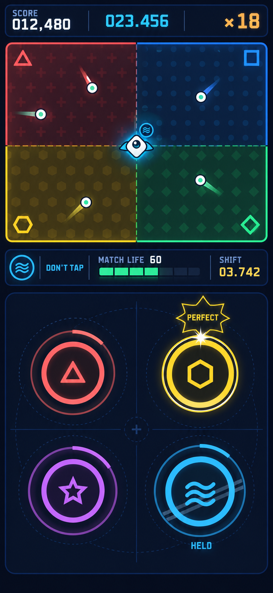

# Dodge Match 인터페이스·비주얼 디자인 플랜

- 작성일: 2026-09-16
- 상태: 첫 구현 비주얼 기준선 — 최종 자산은 별도 디자인 작업
- 기준 문서: [동시 플레이 게임 기획](gameplay.md), [점수와 플레이어 경쟁](scoring-and-leaderboard.md)
- 기준 화면: 모바일·PC 공통 가로 16:9, 좌우 50:50 배치

## 1차 콘셉트 시안



이 이미지는 시각 분위기, 색 체계와 캐릭터 방향만 참고하는 초기 콘셉트다. 세로 구도는 폐기하며 실제 플레이는 아래의 가로 좌우 구조를 따른다.

## 1. 디자인 목표

한 화면에서 회피와 타이밍 게임을 동시에 읽을 수 있어야 한다. Dodge는 공간과 움직임, Match는 색과 박자를 담당한다. 두 영역은 형태 언어를 분리하되, 캐릭터가 서 있는 구역의 색이 Match 금지색이라는 연결은 항상 보여준다.

첫 시각 방향은 **Neon Orbit Arcade**를 제안한다. 어두운 남청색 바탕, 밝은 7색 신호, 굵은 외곽선과 픽셀 감성의 표시 서체를 조합한다. 캐릭터와 효과는 둥근 벡터 형태로 만들어 작은 모바일 화면에서도 읽히게 한다. 레트로 분위기는 해상도를 낮추는 방식보다 타이포그래피, 제한된 발광, 짧고 명확한 모션에서 만든다.

핵심 원칙은 다음과 같다.

1. **동시 시인성:** 시선을 한쪽에 두어도 다른 쪽의 위험·판정·생명 변화를 주변 시야로 감지할 수 있어야 한다.
2. **색 이외의 단서:** 7색은 각각 고유 기호와 패턴을 갖는다. 색각 차이와 어두운 화면에서도 상태를 구분한다.
3. **판정 순간의 명료함:** 링과 원 테두리가 접촉하는 순간이 효과가 없어도 보인다. 장식 모션이 정답 시점을 가리지 않는다.
4. **게임 정보 우선:** 점수, 시간, 콤보, 생명과 금지색은 플레이 오브젝트와 겹치지 않는 고정 HUD에 둔다.
5. **실패 원인 설명:** 게임 오버 연출과 결과 화면에서 회피 충돌인지 Match 생명 소진인지 바로 알 수 있다.

## 2. 가로 화면 구조

논리 기준은 1600×900이며 중앙선을 기준으로 두 플레이 영역을 50:50으로 나눈다. 기본은 Dodge 왼쪽, Match 오른쪽이고 설정에서 완전히 대칭 교환한다.

```text
┌────────────────────────────────────────────────────────────────────┐
│ SCORE 012,480   02:23.456   ×18   LIFE ███████░   SHIFT 03.742    │ HUD 9%
├─────────────────────────────────┬──────────────────────────────────┤
│                                 │                                  │
│          DODGE                  │             MATCH                │
│    점 •     Pip       •         │       ◯          ◯               │
│                                 │            ◯                     │
│  현재 금지색 칩                 │                     ◯            │
│                                 │                                  │
└─────────────────────────────────┴──────────────────────────────────┘
```

- 공통 HUD는 합산 점수, 분:초.밀리초 시간, 점수 콤보, Match 생명과 다음 색 전환 시간을 표시한다.
- 현재 금지색 칩은 Dodge 쪽 캐릭터 가까이와 공통 HUD 양쪽에서 확인할 수 있게 한다.
- Dodge와 Match 영역에는 플레이 오브젝트와 순간 판정 텍스트만 둔다.
- Match 원 생성 안전 여백은 영역 가장자리 24 논리 픽셀로 시작하고 최소 48dp 터치 영역을 유지한다.
- 좁은 가로 화면에서도 플레이 영역 비율을 바꾸지 않는다. 전체 캔버스를 축소하고 남는 화면은 레터박스로 처리한다.
- 세로 방향에서는 게임 대신 회전 안내를 보여준다.

## 3. 시각 토큰과 색상

### 기본 화면색

| 토큰 | 값 | 용도 |
| --- | --- | --- |
| `ink-950` | `#080B18` | 앱 최외곽 배경 |
| `ink-900` | `#10152B` | 플레이필드 기본면 |
| `ink-800` | `#1B2240` | HUD·패널 |
| `line` | `#354064` | 비활성 테두리·구분선 |
| `text-primary` | `#F7F8FF` | 주요 숫자·텍스트 |
| `text-secondary` | `#AAB3D2` | 보조 설명 |
| `shadow` | `#02030A` | 외곽선·그림자 |

### 일곱 색과 보조 기호

| 색 이름 | 신호색 | 구역 바탕 | 고유 기호 | 패턴 |
| --- | --- | --- | --- | --- |
| 빨강 | `#FF5C6C` | `#351824` | 세로 막대 `│` | 세로선 |
| 주황 | `#FF9F43` | `#392315` | 삼각 `▲` | 사선 `/` |
| 노랑 | `#FFD93D` | `#3A3212` | 별 `✦` | 점 배열 |
| 초록 | `#45D483` | `#143425` | 마름모 `◆` | 격자 |
| 파랑 | `#35B9FF` | `#123047` | 물결 `≈` | 가로선 |
| 남색 | `#7182FF` | `#1A2148` | 이중점 `:` | 대각 교차 |
| 보라 | `#C86BFA` | `#321A44` | 초승달 `◐` | 큰 원점 |

- 구역 바탕은 저채도·저명도 색을 쓰고, 원·링과 금지색 칩에는 밝은 신호색을 쓴다.
- 각 구역에는 대응 기호를 10~14% 불투명도의 패턴으로 반복한다. 원 중심과 금지색 칩에도 같은 기호를 표시한다.
- 빨강을 실패 전용색으로 쓰지 않는다. `Miss`는 빨강과 별도로 형태·텍스트·흔들림으로 표현한다. 빨간 원도 정상 타깃일 수 있기 때문이다.
- 텍스트와 중요한 외곽선은 배경색에 따라 흰색 또는 `ink-950`을 선택한다. 실제 대비는 구현 시 WCAG 대비 검사로 확인한다.

## 4. 반려견 기반 캐릭터 디자인

최종 플레이어 캐릭터는 사용자가 제공하는 반려견 사진과 영상에서 귀, 얼굴형, 털색, 무늬, 표정처럼 알아보기 쉬운 특징을 추려 귀여운 게임 캐릭터로 재구성한다. 현재 Pip 콘셉트는 실제 반려견 자산이 준비될 때까지 사용하는 크기·판독성 플레이스홀더다.

- 원본 사진·영상은 공개 저장소에 커밋하지 않는다. 캐릭터 제작 입력으로만 사용하고, 사용자가 승인한 파생 게임 자산만 `docs/design` 또는 dev 자산 경로에 넣는다.
- 영상은 얼굴·전신·대표 움직임이 선명한 프레임을 추출해 사진과 함께 참고한다.
- 첫 시안은 실제 특징을 보존한 2~3개 스타일 변형으로 만들고, 선택된 방향으로 투명 배경 마스터와 게임 상태를 제작한다.
- 필요한 상태는 `idle`, `move`, `near-hit`, `hit`, `match-success`다. 각 상태는 좌우 어느 배치에서도 사용할 수 있게 방향 의존 장식을 피한다.
- 마스터 자산은 충분히 큰 투명 PNG로 보관하고 실제 게임에서는 약 30~34dp로 표시한다. 축소했을 때 귀·얼굴 윤곽과 핵심 무늬가 남아야 한다.
- 충돌 판정은 그림의 털이나 귀 끝과 분리한다. 표시 반지름 3U 안에 캐릭터를 배치하고 실제 원형 충돌 반지름은 2.25U로 고정한다.
- 몸체에는 3dp 상당의 어두운 외곽선을 두어 일곱 바닥색에서 윤곽을 유지한다.
- 현재 구역색은 캐릭터 아래의 반투명 원형 조명과 고유 기호 배지로 표시한다. 이 효과는 캐릭터 고유 털색을 덮지 않는다.
- 이동 중에는 몸체가 진행 방향으로 최대 8° 기울고 80ms 길이의 짧은 잔상이 생긴다. 정지 중에는 1.2초 주기의 2% 호흡 모션만 사용한다.
- 위험 근접 시 외곽선이 한 번 수축하고, 충돌 시 표정과 실루엣이 함께 바뀐다. 강한 섬광으로 캐릭터 특징을 가리지 않는다.

## 5. 회피 점 디자인

회피 점은 Match 타이밍 원과 혼동되지 않도록 **작고 완전히 채워진 중성색 탄환**으로 만든다.

- 몸체: 지름 10~14dp의 흰색 원, 2dp의 짙은 외곽선.
- 중심: 2dp의 밝은 민트색 핵. 구역색 7종과 연결되지 않는 고정색을 쓴다.
- 이동: 속도 방향 뒤에 24~40ms 길이의 짧은 꼬리를 둬 궤적을 읽게 한다. 실제 충돌 범위는 본체만이다.
- 벽 반사: 접점에 100ms짜리 작은 각도 표시를 내고 꼬리 방향을 즉시 전환한다. 과도한 파티클은 쓰지 않는다.
- 추가 생성: 등장 위치에 500ms 전 작은 십자 조준선과 수축 점을 보여준다. 캐릭터 안전 거리 안에는 예고도 생성하지 않는다.
- 속도·개수가 늘어도 모든 점은 같은 모양을 쓴다. 위험도 색상 등급을 추가하면 구역색 규칙과 충돌하므로 피한다.

## 6. 타이밍 원과 수축 링

타이밍 오브젝트는 **중심 원 + 색 테두리 + 고유 기호 + 바깥 수축 링**의 네 층으로 만든다.

| 요소 | 권장값 | 역할 |
| --- | --- | --- |
| 중심 원 | 지름 56dp, `ink-900` 채움 | 터치 대상의 본체 |
| 색 테두리 | 5dp, 해당 신호색 | 원의 색 식별 |
| 중심 기호 | 22dp, 해당 신호색 또는 흰색 | 색 이외의 식별 |
| 수축 링 | 3dp, 시작 지름 96dp → 56dp | 정답 시각 표시 |
| 터치 여유 | 본체 바깥 최대 8dp | 모바일 조작성 보정 |

- 링은 처음부터 끝까지 끊김 없는 실선으로 줄어든다. 꼬리, 회전, 점멸은 정확한 접촉 시점을 흐리므로 쓰지 않는다.
- 정답 순간 링과 원 테두리가 정확히 겹치며 60ms 동안 2dp 흰색 접촉광이 나타난다. 접촉광은 판정을 알려주는 장식이고 판정 계산 기준은 아니다.
- T−200ms에 상태가 잠기면 허용 타깃은 중심 기호가 한 번 선명해지고, 금지 타깃은 중심에 `손대지 않음`을 뜻하는 두 줄 보호띠가 생긴다. 보호띠에는 해당 색 기호를 유지해 색을 가리지 않는다.
- 금지 타깃은 링이 똑같이 수축한다. 플레이어가 ‘누르지 않을 타이밍’도 읽을 수 있어야 하기 때문이다.
- 여러 원이 겹쳐 보일 때 앞뒤 관계가 생기지 않도록 링과 터치 여유 영역까지 겹치지 않는 배치를 우선한다. 불가피한 경우 생성 순서가 빠른 원의 링을 더 밝게 하고 중심 위에 작은 순번 점을 둔다.
- 판정 후 원은 140ms 이내에 사라진다. 성공은 중심으로 수축, Miss는 두 조각으로 갈라져 바깥으로 6dp 이동한다.

## 7. HUD, 점수판과 시간 표시

### 플레이 중 점수판

- 점수: `SCORE 012,480`처럼 최대 자릿수를 고려해 왼쪽 정렬한다. 숫자가 늘어도 주변 요소가 움직이지 않도록 고정 폭 영역을 둔다.
- 시간: `02:23.456`처럼 분:초와 소수점 이하 세 자리를 표시한다. 점수와 폭이 흔들리지 않도록 고정 폭 영역을 사용한다.
- 숫자 서체: tabular numerals를 지원하는 고정폭 또는 반고정폭 서체. 소수점과 세 자리 밀리초의 폭이 흔들리지 않아야 한다.
- 화면 갱신: 내부 시간은 단조 증가 시계를 사용한다. 표시는 매 프레임 갱신하되, 프레임이 끊겨도 시간이 느려지거나 되감기지 않는다.
- 콤보: `×18`을 오른쪽에 표시하고 10, 25, 50, 100 구간 진입 시 한 번 확대한다. 계속 튀는 애니메이션은 피한다.

### 연결 HUD

- 금지색 칩: `DON'T TAP` 라벨, 신호색 선, 고유 기호, 색 이름을 함께 표시한다. `ZoneResolver`가 10% 완충값을 넘어 새 구역을 확정하면 캐릭터 조명과 함께 100ms 교차 전환한다.
- Match 생명: 길이 140dp 이상 수평 게이지. 현재 수치 `60`을 내부에 표시한다. 회복은 오른쪽으로 흐르는 광선과 `+4`, 중립은 짧은 흰색 테두리, 감소는 왼쪽으로 밀리는 절단선과 `−8`로 표현한다.
- 색 전환 시간: `SHIFT 03.742`처럼 소수점 세 자리까지 표시한다. 마지막 0.500초에는 배경이 한 번 좁아지고 `LOCK` 보조 문구를 표시해 새 원 생성 중지 구간을 알린다.
- 생명 25 이하는 게이지 윤곽이 두꺼워지고 심박 모션을 한 번씩 낸다. 색만 붉게 바꾸지 않는다.

### 결과 점수판

결과 화면의 우선순위는 최종 점수 → 완주/실패 원인 → 구성 점수 → 판정 분포 → 최고 기록 비교다.

```text
RUN OVER · DODGE HIT
42.817 SEC

TOTAL                  018,740
─────────────────────────────
DODGE                    4,200
MATCH                   14,540

PERFECT  72   GREAT 18   GOOD 6   MISS 4
MAX COMBO ×41      ACCURACY 92.4%

[ RETRY ]                    [ RANKING ]
```

- 획득 점수와 차트 만점을 함께 표시할 때는 `18,740 / 32,500`과 달성률을 병기한다.
- 판정 분포는 판정 단어, 아이콘, 숫자를 모두 보여준다. 색 띠만으로 요약하지 않는다.
- 새 최고 기록은 점수 숫자 뒤에 `NEW BEST` 스탬프를 1회 찍는다.

## 8. 판정 표현

판정 텍스트는 원이 있던 위치에서 화면 중심 쪽으로 16dp 이동한 곳에 350~500ms 표시한다. 여러 판정이 가까이 발생하면 이전 텍스트를 위로 18dp 밀어 겹침을 피한다. 화면 중앙에 큰 텍스트를 반복해서 띄워 다른 원을 가리지 않는다.

| 판정 | 형태 | 색·타입 | 모션 | 보조 정보 |
| --- | --- | --- | --- | --- |
| `PERFECT` | 8각 별 테두리 | 흰색 중심 + 해당 타깃색 광 | 100%→116%→100%, 220ms | 작은 `0–60ms` 광점 |
| `GREAT` | 위로 열린 날개형 선 | 민트 `#58E6C2` | 위로 8dp 상승, 260ms | `EARLY 084ms` 또는 `LATE 084ms` |
| `GOOD` | 둥근 직사각 테두리 | 앰버 `#FFD166` | 1회 부드러운 눌림, 300ms | `EARLY/LATE` 표시 |
| `MISS` | 끊어진 사각 프레임 | 코럴 `#FF667A` | 좌우 4dp 흔들림 2회, 320ms | `EARLY`, `LATE`, `MISSED`, `FORBIDDEN` |

- 판정 단어는 대문자 영문으로 통일하고 바로 아래 원인 또는 빠름/늦음을 작은 글자로 둔다.
- Perfect만 화면 전체의 아주 약한 80ms 밝기 상승을 허용한다. 광과 파티클은 15% 이하 불투명도로 제한한다.
- 금지색 원을 올바르게 누르지 않은 Perfect에는 `HELD` 또는 손을 뗀 아이콘을 붙여 능동적으로 잘한 행동임을 알려준다.
- `Miss`의 네 원인은 결과 기록에서도 구분할 수 있게 아이콘을 둔다: 너무 빠름 `«`, 너무 늦음 `»`, 놓침 `○`, 금지색 터치 `손+보호띠`.
- 진동·음향은 보조 피드백이다. 무음·무진동에서도 텍스트, 형태와 모션만으로 같은 정보를 얻는다.

## 9. 색 구역 전환 표현

- 평상시 구역 경계는 총 폭 2U의 어두운 십자 마진으로 고정한다. 경계선 자체가 움직이지 않게 해 캐릭터 위치 판단을 돕는다.
- 캐릭터가 경계 마진에 들어오면 현재 판정 구역 쪽의 바닥 패턴을 캐릭터 아래에서 조금 더 밝히고, 반투명 원형 조명을 현재 판정색으로 유지한다.
- 겹침 면적 완충값 때문에 판정색이 유지되는 동안 조명도 유지한다. 새 구역이 10% 우세해 판정이 바뀌면 조명과 HUD 칩을 100ms 교차 전환한다.
- T−200ms에 Match 원의 상태가 잠기는 순간 캐릭터 아래 조명을 80ms 밝게 하고, 잠긴 금지색 기호를 HUD에 짧게 확대한다.
- 전환 3초 전부터 연결 HUD의 `SHIFT`가 강조된다. 0.500초 전에는 플레이필드 외곽이 안쪽으로 한 번 수축해 생성 중지 구간을 알린다.
- 전환 시각 T에서 새 색과 패턴을 즉시 적용한다. 긴 크로스페이드는 현재 금지색을 모호하게 하므로 쓰지 않는다.
- T 직후 120ms 동안 구역마다 중심에서 바깥으로 얇은 확인선이 퍼진다. 이 효과는 색 적용 이후의 확인 피드백이다.
- 캐릭터의 금지색 배지와 연결 HUD는 같은 프레임에 새 색·기호로 바뀐다.

## 10. 게임 오버 효과와 화면

Dodge 충돌 또는 Match 생명 0에서 즉시 플레이를 멈추고 원인별 연출 뒤 공통 결과 화면으로 이동한다.

### 회피 점 충돌

1. 충돌 순간 80ms 정지한다.
2. 충돌점에서 흰색 얇은 원이 180ms 퍼지고 캐릭터 외곽선이 네 조각으로 8dp 벌어진다.
3. 회피 영역만 250ms 동안 명도를 낮추고 `DODGE HIT`을 표시한다.

### Match 생명 0

1. 생명 게이지의 마지막 조각이 왼쪽으로 빠져나가며 120ms 정지한다.
2. 타이밍 영역의 링들이 중심에서 끊기고 아래로 12dp 떨어진다.
3. Match 영역만 250ms 동안 명도를 낮추고 `SYNC LOST`를 표시한다.

### 공통 전환

- 500~700ms 안에 두 플레이필드를 60% 어둡게 하고 `RUN OVER`를 표시한다.
- 마지막 점수와 `00:23.456`을 먼저 고정한 뒤 결과 카드가 아래에서 올라온다.
- 재시도 버튼은 700ms 뒤 활성화해 실수로 연속 터치되는 것을 막는다.
- 강한 화면 흔들림, 전체 흰색 섬광과 장시간 진동은 쓰지 않는다. 설정에서 화면 흔들림과 발광을 줄이는 `Reduced Effects`를 제공한다.

곡 완주의 경우 실패 연출 대신 모든 링이 바깥으로 확장되고 `TRACK CLEAR`를 표시한다. 결과 화면 구조는 동일하게 유지한다.

## 11. 필요한 화면과 디자인 자산

### 화면

1. 타이틀·플레이 시작
2. 첫 플레이 튜토리얼: 드래그, 허용색 터치, 금지색 미터치
3. 3초 카운트다운
4. 인게임 기본·고밀도 상태
5. 일시정지·백그라운드 복귀 안내
6. 원인별 게임 오버와 곡 완주
7. 결과 점수판
8. 로컬 리더보드와 이름 입력
9. 설정: 좌우 배치, 음악 켜기/끄기, 음악·효과음 음량, 진동, Reduced Effects, 색·기호 안내

### 컴포넌트와 상태

- 반려견 캐릭터: idle, move, near-hit, hit, match-success 반응
- 회피 점: spawn-warning, moving, bounce, collision
- 타이밍 원: appearing, approaching, locked-allowed, locked-forbidden, judged 4종
- 판정 텍스트: 4등급과 Miss 원인 4종, Early/Late
- HUD: score, elapsed time, combo, forbidden-color chip, life, shift timer
- 버튼: default, pressed, disabled, focus
- 결과 카드, 판정 분포 행, 리더보드 행, 이름 입력

### 오디오·촉각과 연결할 이벤트

디자인 단계에서 이벤트 이름만 고정하고 실제 사운드는 별도 제작한다: `target_spawn`, `ring_contact`, `perfect`, `great`, `good`, `miss`, `life_gain`, `life_loss`, `zone_shift`, `dodge_bounce`, `dodge_hit`, `run_clear`. 모든 이벤트는 시각 표현을 먼저 갖는다.

## 12. 접근성·사용성 확인 항목

- 7색을 흑백으로 바꿔도 기호와 패턴으로 구분되는가.
- 한 손가락이 회피 영역을 가린 상태에서도 캐릭터와 위험 점을 추적할 수 있는가.
- 다른 손가락이 타이밍 원을 눌러도 다음 원과 링이 가려지지 않는가.
- 4개의 원이 동시에 있어도 각각의 링, 기호, 생성 순서를 읽을 수 있는가.
- `02:23.456`과 `SHIFT 03.742`를 혼동하지 않도록 라벨과 위치가 고정되어 있는가.
- Perfect/Great/Good/Miss를 색 없이 형태·단어·모션으로 구분할 수 있는가.
- Reduced Effects에서도 정확한 타이밍, 색 전환과 실패 원인이 모두 전달되는가.
- 가장 작은 지원 화면에서 48dp 터치 영역과 안전 영역을 지키는가.
- 십자 경계 안에서 미세하게 움직여도 현재 판정색 조명이 깜빡이지 않고 실제 금지색과 일치하는가.

## 13. 첫 구현 디자인 결정

- 전체 분위기는 어두운 **Neon Orbit Arcade**로 진행한다.
- 캐릭터 Pip은 반려견 사진·영상 기반 캐릭터가 준비될 때까지 사용할 플레이스홀더다.
- 판정은 영문 `PERFECT/GREAT/GOOD/MISS`, 안내와 설정은 한글을 기본으로 한다.
- 모바일·PC 모두 가로 16:9와 좌우 50:50 구조를 사용한다.
- 인게임 시간은 `02:23.456` 형식으로 표시한다.
- T−200ms에 금지 상태가 잠기면 보호띠를 표시한다.
- 실제 구현 후 저충실도 화면 QA → 핵심 플레이 고충실도 시안 → 판정·게임오버 모션 → 결과·리더보드 순으로 다듬는다.
